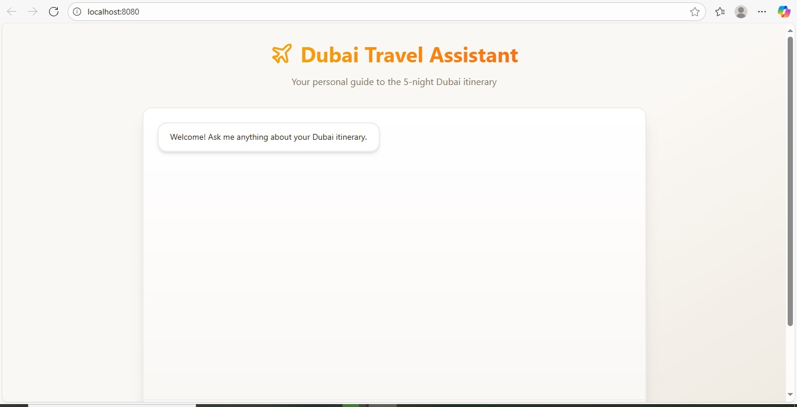
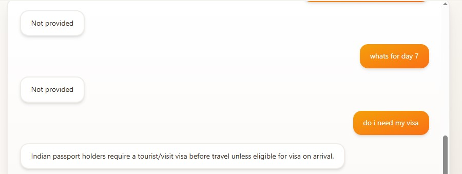
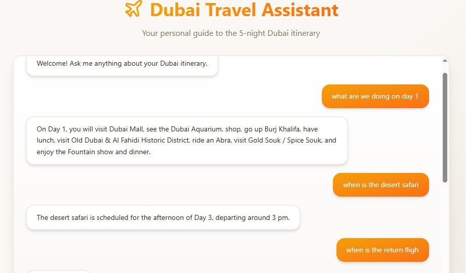

# Dubai Travel Assistant – Your Personal Itinerary Chatbot

## Screenshots

Here’s a preview of the Dubai Travel Assistant interface:







## Demo Video

You can see the Dubai Travel Assistant in action here:
[Watch the demo on Loom](https://www.loom.com/share/3f14ad4820e147c79d52494340063cd9?sid=a0821c82-5534-40d1-ba0a-eb6319c5643e)

---

## Overview

Dubai Travel Assistant is a personal AI-powered chatbot designed to answer any question about a **5-night Dubai itinerary from Bangalore**. Ask about flights, hotels, activities, or travel tips, and get precise answers — or “Not provided” if the information isn’t available.

This is a **full-stack project** with a **React frontend** and an **AI backend**, deployed seamlessly via Lovable Cloud.

---

## Features

* AI chatbot capable of understanding natural questions and retrieving itinerary information
* Conversational interface with streaming responses
* Provides specific answers or “Not provided” for unknown queries
* Fully responsive single-page frontend built with **React + TailwindCSS**
* Dubai-inspired design with elegant styling and smooth UX
* Easily extendable to other itineraries or travel guides

---

## How It Works

The chatbot uses **Lovable Cloud** with Supabase Edge Functions and Google Gemini AI:

1. **User Input** – Enter your question in the chat interface
2. **Edge Function** – The request is routed through a Supabase Edge Function
3. **AI Processing** – Gemini 2.5 Flash model processes the query using the itinerary as context
4. **Strict Rules** – AI only answers from the itinerary or returns **“Not provided”**
5. **Response** – Answer is displayed in the frontend

**Flow:**
`User question → Edge Function → Gemini AI + Itinerary Context → Answer → Display`

---

## Tech Stack

* **Frontend:** React, TypeScript, Vite, TailwindCSS, shadcn-ui
* **Backend:** Supabase Edge Functions
* **AI:** Google Gemini 2.5 Flash

---

## Getting Started

### Local Development

```bash
# Clone the repository
git clone <YOUR_GIT_URL>
cd <YOUR_PROJECT_NAME>

# Install dependencies
npm install

# Start the development server
npm run dev
```

The frontend will be available at `http://localhost:8080`.

### Backend Setup

No additional setup is needed — backend is preconfigured with:

* Supabase Edge Functions
* Required environment variables

---

## Deployment

To deploy your app, open the project in Lovable and click **Share → Publish**. The app will go live instantly with both frontend and backend automatically deployed.

---

## Editing the Project

* **Preferred IDE:** Clone the repo, make edits, and push changes
* **GitHub:** Edit files directly using the pencil icon
* **GitHub Codespaces:** Launch a Codespace for cloud-based development

---


